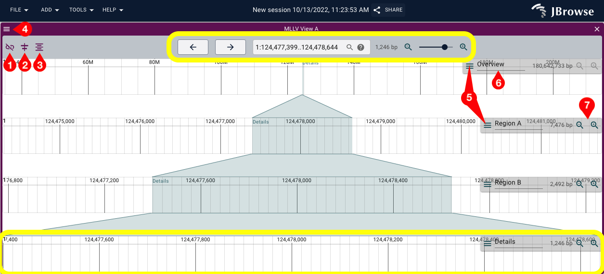
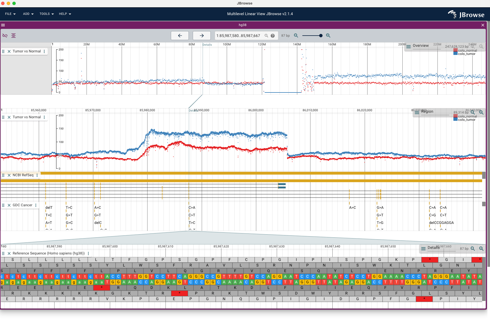

# jbrowse-plugin-multilevel-linear-view

> JBrowse 2 plugin that adds a linear genome view that can show multiple zoom levels.

## Install

### For JBrowse Web and JBrowse Desktop

Install the multilevel-linear-view Plugin through the in-app plugin store. Need some help? Check out [the guide on how to use the plugin store here](https://jbrowse.org/jb2/docs/user_guide/#using-the-plugin-store).

## Usage

### Development

```
git clone https://github.com/GMOD/jbrowse-plugin-multilevel-linear-view
cd jbrowse-plugin-multilevel-linear-view
yarn
yarn start
```

Then (assuming JBrowse Web is running on port 3000) open JBrowse Web to the following:

http://localhost:3000/?config=http://localhost:9000/config.json

Need help getting JBrowse Web running? [Read the docs here](https://jbrowse.org/jb2/docs/quickstart_web).

### Production

Add to the "plugins" of your JBrowse Web config:

```json
{
  "plugins": [
    {
      "name": "MultilevelLinearView",
      "url": "https://unpkg.com/jbrowse-plugin-multilevel-linear-view/dist/jbrowse-plugin-multilevel-linear-view.umd.production.min.js"
    }
  ]
}
```

## Terminology

`anchor`: The "anchor" view is the central control for all sub views. Your workflow should be based around the context of the anchor view. The anchor view will always be the lowest zoom level of all views.

`overview`: The "overview" view is the highest level view of the region that cannot be zoomed in or out.

`sub view`: The "sub" views are all other views that support the anchor and overview. They will always be between the anchor and the
overview.

`linked`: The status of the multi-level linear view when views will move and behave together based on actions performed on the anchor view.

`ascending`: The views ordered such that the 'overview' is at the top level of the cascading multi-level of views, and the 'anchor' is at the bottom.

`descending`: The views ordered such that the 'anchor' is at the top level of the cascading multi-level of views, and the 'overview' is at the bottom.

## Control options

### Toggle linked views

This button will toggle whether the views are linked together. When the views are linked together, operations will occur simultaneously based on operations performed on the 'anchor'.

### Align views

Linked or unlinked, this button will realign all sub views to the anchor view. That is, the centre of all sub views will be aligned to the centre of the anchor view.

This control is useful if you are browsing a sub view unlinked, and then wish to re-aligned all your subviews to the anchor.

### Reset sub view zoom levels

Linked or unlinked, this button will bring all sub views within one zoom level of the anchor view, and subsequently within one zoom level of each other.

This control is useful if you find your zoom levels are too far out from the anchor and wish to reset the zoom levels close to the context of the anchor.

### Zoom in and zoom out

These buttons found in the 'mini menu' of each view will zoom that view in and out.

All zoom actions will attempt to maintain a cascading relationship between the views. For example, zooming in on a view on a descending multilevel linear view that has a neighbour below it, will also zoom in that neighbour to maintain the cascading relationship.

## Screenshots



Figure: a multilevel linear view with no tracks open.

From the figure, controls are as follows:

1. Link / unlink views
2. Align views to the current
3. Reset zoom levels
4. Menu options for the multilevel linear view, including changing the cascading order
5. Individual menu options for each linear genome view on the mini controls
6. View name text field for each linear genome view on the mini controls
7. Individual zoom controls for each linear genome view on the mini controls

**Highlighted in yellow** the top level controls on the header control the movement and zoom of the anchor (pictured: named Details).


<br>
Figure: a .gif of the movement and some options possible with the multilevel linear view.


Figure: a screenshot of a populated multilevel linar genome view
